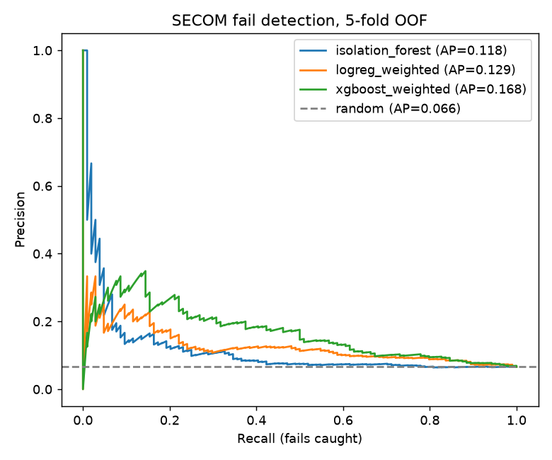
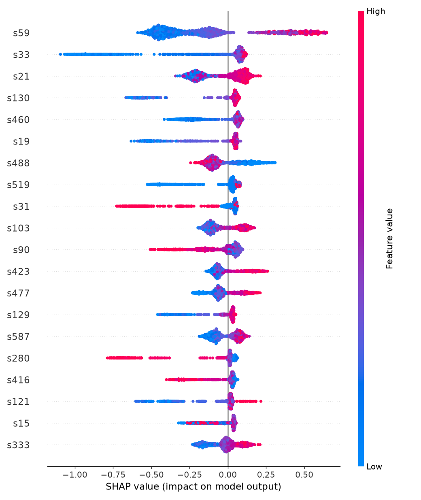

# SECOM Wafer Fail Detection

Pass/fail prediction on the [UCI SECOM](https://archive.ics.uci.edu/dataset/179/secom) dataset:
1567 wafer lots, 590 sensor readings per lot, 104 fails (6.6%).

## Method

- Drop sensors with more than 50% missing values or a single constant value. 590 -> 446 features.
- Median imputation fit inside each CV fold.
- Models: Isolation Forest (fit on passing lots only), class-weighted Logistic Regression,
  XGBoost with `scale_pos_weight = neg/pos`.
- Stratified 5-fold CV, out-of-fold predictions.
- Metrics: PR-AUC, ROC-AUC, recall at 10% false positive rate. Random baseline for PR-AUC is 0.066.
- SHAP feature ranking on the best supervised model.

## Results

| Model | PR-AUC | ROC-AUC | Recall @ 10% FPR |
|---|---|---|---|
| Random | 0.066 | 0.500 | 0.100 |
| Isolation Forest | 0.118 | 0.555 | 0.202 |
| Logistic Regression (weighted) | 0.129 | 0.663 | 0.221 |
| XGBoost (weighted) | 0.168 | 0.707 | 0.337 |

Top sensors by mean |SHAP| for XGBoost: s59, s33, s21, s130, s460, s19, s488, s519, s31, s103.
Sensor ids are anonymised in the source data.




## Notes

- 104 positives. Expect fold-to-fold variance of a few points.
- Default hyperparameters, no search.
- Timestamps in the label file are not used. A time-ordered split would be a stricter test.
- The unsupervised model is close to chance. Fails are not outliers in raw sensor space on this data.

## Run

```
python -m venv .venv
.venv\Scripts\pip install -r requirements.txt
python secom.py
```

Data is in `data/`. Outputs go to `results/`.
